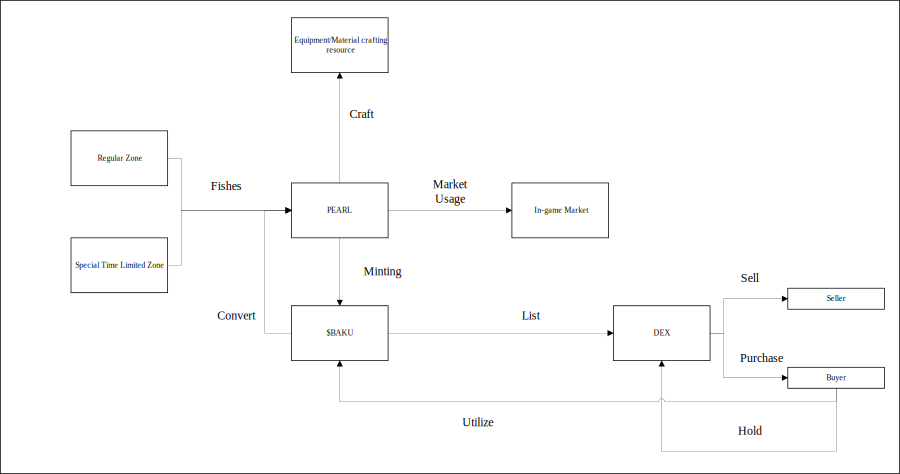

# Tokenomics Flow (Player Guide)

****

---

## Overview
This shows how **PEARL** and **$BAKU** move around the game — from fishing and crafting to trading and using tokens again in-game. Everything connects in a simple loop where what you earn can be used, traded, or reinvested.

---

## Flow Steps

1. **Fishing (Regular or Special Zones)**
   - Go fishing in **Regular Zones** for normal rewards or **Special Time-Limited Zones** for bigger catches.  
   - You’ll earn **PEARL (Perlas)**, your main in-game currency.

2. **Crafting**
   - Use **PEARL** to craft new **equipment** or **materials** that improve your gameplay.

3. **Minting (PEARL → $BAKU)**
   - You can **convert PEARL into $BAKU tokens**, making your in-game progress part of the blockchain economy.

4. **Market Usage**
   - Spend **PEARL** in the **in-game market** to buy or sell crafting materials, gear, and other items.

5. **Trading ($BAKU on DEX)**
   - Trade **$BAKU** on a **Decentralized Exchange (DEX)** to sell it for crypto or buy more with USDT.

6. **Holding**
   - Keep **$BAKU** in your wallet like any other cryptocurrency — use it later or hold it as an investment.

7. **Utilization (Back to Game)**
   - Bring **$BAKU** back into the game anytime to buy, trade, or reinvest in your in-game assets.

---

## Summary

| Step | Action | Description |
|------|---------|-------------|
| 1 | Fish | Earn PEARL in fishing zones |
| 2 | Craft | Use PEARL for crafting materials and gear |
| 3 | Mint | Convert PEARL to $BAKU on-chain |
| 4 | Trade | Use PEARL or $BAKU in markets or DEX |
| 5 | Hold | Keep $BAKU in your wallet |
| 6 | Reuse | Bring $BAKU back into the game |

---

## Notes
- **PEARL:** In-game currency earned from fishing and crafting.  
- **$BAKU:** Blockchain token you can trade or use back in-game.  
- **DEX:** Marketplace for crypto trading outside the game.  
- The loop never ends — everything you earn can return to gameplay!
