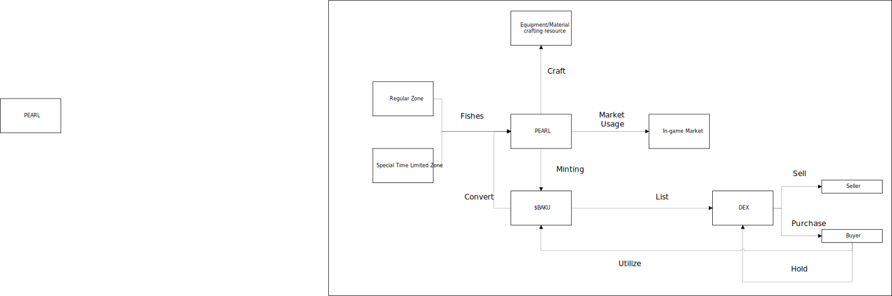

# Tokenomics Flow

****

---

## Overview
This diagram delineates the complete token flow within the ecosystem, illustrating the interaction between in-game and blockchain components. It highlights the processes through which players acquire, convert, and utilize **PEARL** and **$BAKU** tokens, establishing a sustainable circular economy that integrates gameplay with decentralized finance.

---

## Flow Steps

1. **Fishing (Regular Zone / Special Time-Limited Zone)**
   - Players engage in fishing within **Regular Zones** or **Special Time-Limited Zones**.  
   - Successful fishing yields **PEARL (Perlas)**, the foundational in-game currency.  
   - **Special Time-Limited Zones** offer increased yields and limited-time opportunities.

2. **Crafting**
   - **PEARL** serves as the primary material for crafting **equipment** and **resources** within the game ecosystem.

3. **Minting (PEARL → $BAKU)**
   - Players may **mint $BAKU tokens** by converting **PEARL**, thus transferring value from the in-game layer to the blockchain layer.  
   - **$BAKU** represents a tradeable, on-chain asset that mirrors in-game progression.

4. **Market Usage**
   - **PEARL** remains usable within the **in-game marketplace** for transactions involving:  
     - Crafting materials  
     - Equipment  
     - Other player-owned assets

5. **DEX Listing**
   - **$BAKU tokens** can be **listed on Decentralized Exchanges (DEX)**, enabling open crypto-to-crypto trading.

6. **Trading**
   - **Sellers** exchange **$BAKU** for cryptocurrencies such as **USDT** and etc.  
   - **Buyers** acquire **$BAKU** via supported tokens on the DEX.

7. **Holding**
   - Holders may **retain $BAKU** as a speculative asset, reflecting potential value appreciation within the ecosystem.

8. **Utilization (Back to Game)**
   - **$BAKU tokens** held externally may be **reintegrated** into the game, allowing continued participation and reinforcing the cyclical flow of value.

---

## Summary

| Step | Action | From | To | Description |
|------|---------|------|----|-------------|
| 1 | Fishing | Regular / Special Zone | PEARL | Earn PEARL from fishing activities |
| 2 | Crafting | PEARL | Equipment/Material | Utilize PEARL to craft resources |
| 3 | Minting | PEARL | $BAKU | Convert PEARL into tradeable blockchain token |
| 4 | Market Usage | PEARL | In-Game Market | Use PEARL in in-game transactions |
| 5 | Listing | $BAKU | DEX | List token for crypto trading |
| 6 | Trading | DEX | Seller/Buyer | Exchange $BAKU for other cryptocurrencies |
| 7 | Holding | Buyer | Wallet | Store $BAKU as a tradable asset |
| 8 | Utilization | $BAKU | Game | Reintroduce token into gameplay |

---

## Notes
- **Regular Zone:** Standard fishing area with consistent yields.  
- **Special Time-Limited Zone:** Event-based area offering higher rewards.  
- **PEARL (Perlas):** Primary in-game currency earned through gameplay and used in crafting or market activity.  
- **$BAKU:** On-chain representation of game value; tradable and reintegrable into the game.  
- **DEX:** Decentralized Exchange facilitating open crypto-based transactions.  
