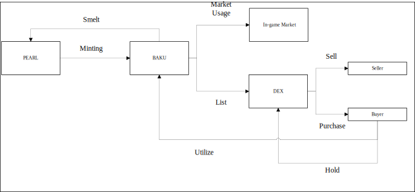

# Tokenomics Flow

****

---

## Overview
This diagram illustrates the flow of tokens within the ecosystem, showing how in-game currency and blockchain assets interact between players, markets, and decentralized exchanges (DEX).

---

## Flow Steps

1. **Minting (PEARL → BAKU)**
   - Players earn **PEARL** (also known as *Perlas*) through play-to-earn mechanics.
   - PEARL serves as the **primary in-game reward source** and can be **converted into BAKU**, the main tradeable token.

2. **In-Game Market Utilization**
   - **BAKU tokens** are used within the **in-game marketplace**, where players can list items such as:
     - Crafting materials  
     - Equipment  
     - Other in-game assets  

3. **DEX Listing**
   - Players may **sell BAKU** on a **Decentralized Exchange (DEX)** for other cryptocurrencies.

4. **Seller Transaction**
   - The **seller** receives equivalent cryptocurrency (e.g., **USDT**) in exchange for their BAKU tokens.

5. **Buyer Transaction**
   - The **buyer** acquires BAKU tokens by paying with **USDT** or another supported cryptocurrency.

6. **Token Holding**
   - Buyers can **hold BAKU** in their crypto wallets, treating it like any other tradable cryptocurrency for investment or future trading.

7. **Game Reutilization**
   - Players who hold BAKU can **reintegrate** the token back into the game ecosystem to purchase or trade in-game assets.

8. **Conversion Back (BAKU → PEARL)**
   - BAKU can be **converted back into PEARL** for in-game use, completing the token cycle.

---

## Summary

| Step | Action | From | To | Description |
|------|---------|------|----|-------------|
| 1 | Minting | PEARL | BAKU | Conversion of in-game earnings to tradeable token |
| 2 | Market Usage | BAKU | In-Game Market | Buy/sell in-game items |
| 3 | Trade | BAKU | DEX | BAKU listed for crypto trading |
| 4 | Seller | DEX | Seller Wallet | Seller receives crypto (USDT) |
| 5 | Buyer | Buyer | DEX | Buyer exchanges USDT for BAKU |
| 6 | Holding | Buyer | Wallet | Buyer holds BAKU as a crypto asset |
| 7 | Utilization | Wallet | Game | BAKU used in-game |
| 8 | Conversion | BAKU | PEARL | BAKU converted back for in-game use |

---

## Notes
- **PEARL (Perlas):** Primary in-game currency earned through gameplay, can be earned through the open world (lower yield) or limited time zones (greater yield).  
- **BAKU:** Blockchain-based token that bridges the in-game and real-world economies.  
- **DEX:** Decentralized Exchange platform enabling crypto-to-crypto trading.

