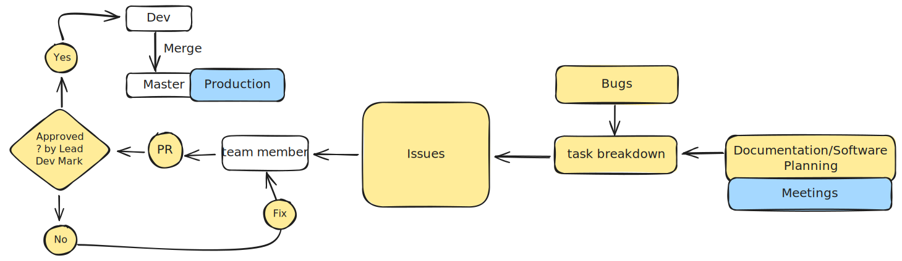

# Team Workflow

1. **Planning Meeting**

Each development cycle starts with a planning meeting. The meeting follows a standardized format; see [Communication in Meeting/Standup](communication/Standup) for details. During the meeting, we:
   - Review current progress
   - Identify roadblocks
   - Break down tasks and assign them to team members
   - Record tasks in the repository's **Issues** tab

2. **Branch Creation**

Each member creates a branch to work on their assigned issues. Refer to [Branching Rules](branching.md#branch-creation) for branch creation guidelines.

3. **Development**

Team members implement the required changes, including coding, documentation, and testing, following our standard commit practices.

4. **Pull Request (PR) and Review**

   Once a task is complete, the team member issues a PR to the `develop` branch.
   - The **Lead Developer** reviews the PR.
   - Any required changes are communicated through the PR comments.
   - The team member updates the branch as needed.
   - After approval, the PR is merged into the `develop` branch.

> _Maintained by the **Lead Developer**. Updated as team conventions evolve._
